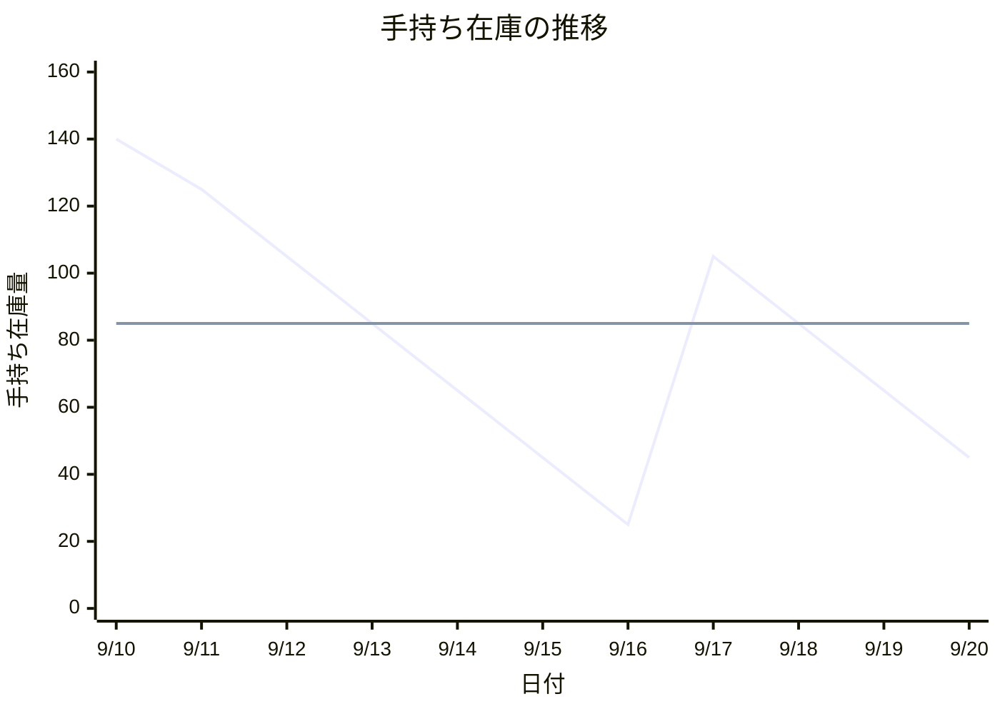

## レポート課題 2025-2

### 問 5

#### 安全在庫量と発注点の計算

- **安全在庫量**:

  - 欠品率 10.565%に対応する安全係数 k は、正規分布表より **1.25** となる。（参考文献: m05-1.pdf p.8, m05-2.pdf p.4）
  - 調達期間中の需要の標準偏差 σL = 1 日の需要の標準偏差 × √ 調達期間 = 2 × √4 = **4 個**
  - 安全在庫量 = 安全係数 k × 調達期間中の需要の標準偏差 σL = 1.25 × 4 = **5 個**

- **発注点**:
  - 調達期間中の平均需要量 = 1 日の平均需要 × 調達期間 = 20 × 4 = **80 個**
  - 発注点 = 調達期間中の平均需要量 + 安全在庫量 = 80 + 5 = **85 個**

#### 9 月 10 日から 20 日までの手持ち在庫量の変動

在庫量の変動は以下の表のようになります。発注点である 85 個を下回った 9 月 13 日と 9 月 18 日に発注が行われます。

| 日付 | 期首在庫 | 納入 | 需要 | 手持ち在庫 | 発注の有無      |
| :--- | :------- | :--- | :--- | :--------- | :-------------- |
| 9/10 | -        | -    | -    | 140        | -               |
| 9/11 | 140      | 10   | 25   | 125        | 無              |
| 9/12 | 125      | 0    | 20   | 105        | 無              |
| 9/13 | 105      | 0    | 20   | 85         | **有 (100 個)** |
| 9/14 | 85       | 0    | 20   | 65         | 無              |
| 9/15 | 65       | 0    | 20   | 45         | 無              |
| 9/16 | 45       | 0    | 20   | 25         | 無              |
| 9/17 | 25       | 100  | 20   | 105        | 無              |
| 9/18 | 105      | 0    | 20   | 85         | **有 (100 個)** |
| 9/19 | 85       | 0    | 20   | 65         | 無              |
| 9/20 | 65       | 0    | 20   | 45         | 無              |

#### ① 発注点について

発注点とは、在庫管理における在庫量の基準値の一つです。在庫がこの水準まで減少したことを確認した時点（棚卸や出庫の記録時）で、あらかじめ定めておいた量（定量）を発注する方式で用いられます。これを「発注点方式」と呼びます。

発注点は、商品が納品されるまでの期間（調達期間）に消費される見込みの量（調達期間中の平均需要量）に、需要のばらつきや調達期間の遅れなど不確実な事態に備えるための予備の在庫（安全在庫）を加えることで設定されます。これにより、調達期間中に在庫がなくなる（欠品する）リスクを、設定した許容範囲内（サービス率）に抑えることができます。

(参考文献: m08-1.pdf p.2, m08-2.pdf p.1)

#### ② 需要の平均や標準偏差が大きく変化した場合の対応について

需要の平均や標準偏差が大きく変化した場合、従来の設定のままでは最適な在庫管理ができなくなります。具体的には、過剰在庫や欠品のリスクが高まります。

- **需要の平均値が変化した場合**:

  - 平均値が増加すれば、在庫の消費ペースが速まるため、発注点を高く修正しないと欠品リスクが増大します。
  - 逆に平均値が減少すれば、在庫の消費ペースが遅くなるため、発注点を低く修正しないと過剰在庫を抱えることになります。

- **需要の標準偏差が変化した場合**:
  - 標準偏差が増加すれば、需要の変動（ばらつき）が大きくなることを意味します。そのため、同じ欠品許容率を維持するためには、より多くの安全在庫が必要となり、結果として発注点も高く設定し直す必要があります。
  - 逆に標準偏差が減少すれば、需要が安定してきたことを意味するため、安全在庫を減らすことができ、発注点も低くすることが可能になります。

したがって、需要の平均や標準偏差に大きな変化が見られた場合は、これらの変化を捉えて、発注点や安全在庫量を再計算し、設定値を更新していく必要があります。

(参考文献: m05-1.pdf p.13, m05-2.pdf p.2)
